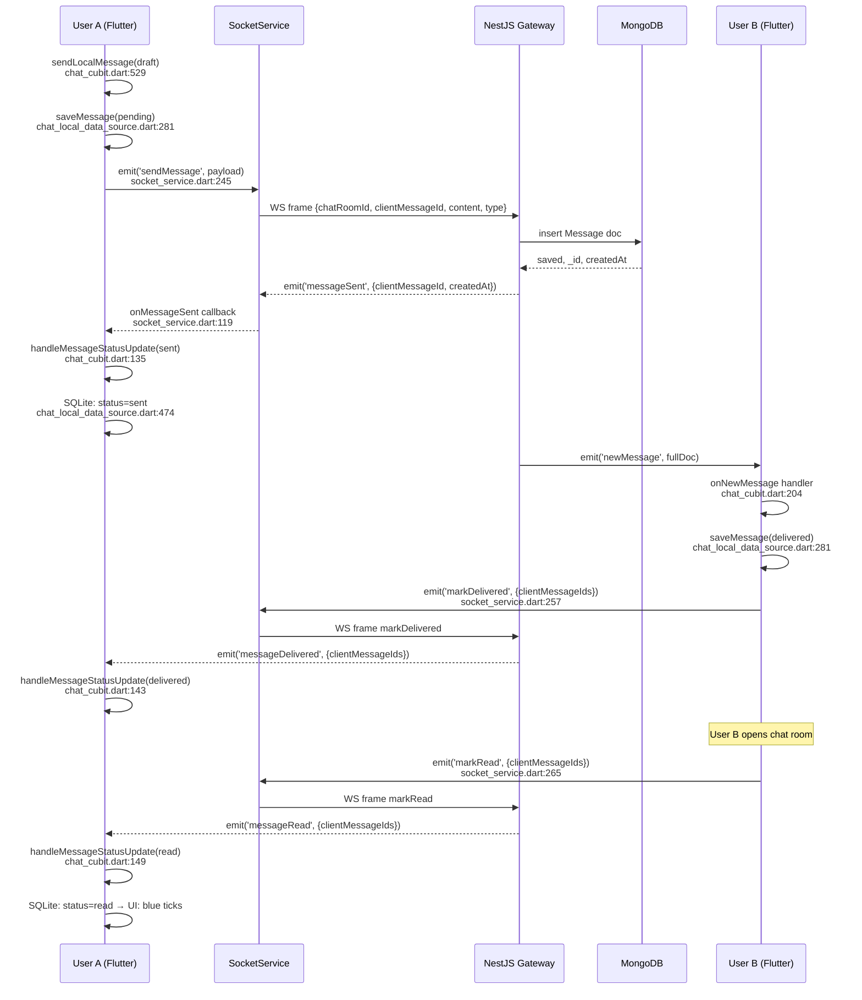
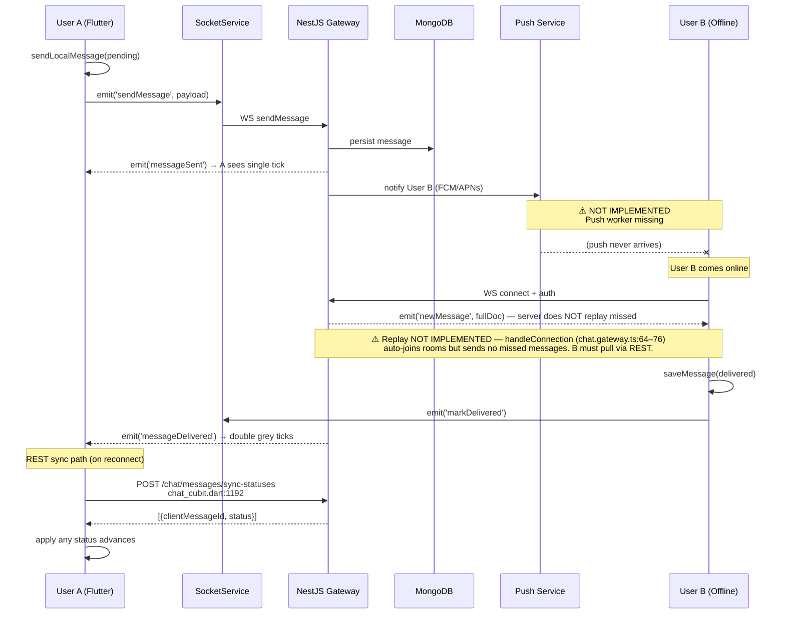

# Chat Lifecycle Audit — Ciro Chat App

**Auditor**: Claude Sonnet 4.6  
**Date**: 2026-05-12  
**Branch**: `003-optimize-chat-lifecycle`  
**Scope**: Flutter client · NestJS backend (source-verified at `/Volumes/Zeyad/Documents/work/Node js/chat-app-backend/src/modules/chat/`) · Spec-Kit specs

---

## 1. Repo Map

### Flutter (`lib/`)

```
lib/
├── main.dart                                            App entry, DI setup, BlocObserver
├── core/
│   ├── di/injection.dart                                get_it + injectable DI root
│   ├── di/injection.config.dart                         Auto-generated DI registrations
│   ├── network/
│   │   ├── dio_client.dart                              Dio singleton + JWT interceptor + refresh logic
│   │   ├── socket_service.dart                          socket_io_client singleton — connect/emit/listen
│   │   └── socket_events.dart                           Typed constants for all socket event names
│   ├── theme/app_constants.dart                         API base URL, timeout values
│   ├── bloc/app_bloc_observer.dart                      Global BLoC transition logger
│   ├── error/failures.dart                              Either<Failure, T> domain error types
│   ├── helpers/permission_service.dart                  Mic/camera permission wrapper
│   ├── services/location_service.dart                   GPS + geocoding service
│   └── utils/url_utils.dart                             Resolves relative media paths to full URLs
├── features/
│   ├── auth/
│   │   ├── data/datasources/auth_local_data_source.dart JWT keychain (FlutterSecureStorage)
│   │   ├── data/datasources/auth_remote_data_source.dart OTP REST calls
│   │   ├── data/repositories/auth_repository_impl.dart
│   │   └── presentation/bloc/auth_cubit.dart            Auth state + connects socket on success
│   ├── chat/
│   │   ├── data/
│   │   │   ├── datasources/chat_local_data_source.dart  sqflite — messages/rooms/contacts/statuses
│   │   │   ├── datasources/chat_remote_data_source.dart Dio REST: upload, fetchRooms, syncStatuses, group ops, block
│   │   │   ├── models/chat_room_model.dart               JSON→ChatSession parser
│   │   │   └── repositories/chat_repository_impl.dart   Wires remote+local into Either<>
│   │   ├── domain/
│   │   │   ├── entities/message.dart                    Message entity + status/type enums + SQLite/network mappers
│   │   │   ├── entities/chat_session.dart               Room entity with ChatRoomType (PRIVATE/GROUP)
│   │   │   └── repositories/chat_repository.dart        Abstract repository interface
│   │   └── presentation/
│   │       ├── bloc/chat_cubit.dart                     All chat business logic (send, receive, paginate, status, sync)
│   │       ├── bloc/chat_state.dart                     ChatInitial/Loading/RoomActive/Error/BlockUpdated/TypingUpdate
│   │       ├── bloc/voice_note_controller.dart           Record + waveform extraction controller
│   │       ├── pages/chat_list_screen.dart               Inbox — StreamBuilder on watchRecentChats()
│   │       ├── pages/chat_room_screen.dart               Message thread — BlocBuilder + reverse ListView
│   │       ├── pages/chat_info_screen.dart               P2P info + quick actions
│   │       ├── pages/group_chat_screen.dart              Group thread page
│   │       ├── pages/group_info_page.dart                Group members + admin status
│   │       ├── pages/create_group_page.dart              Group creation flow
│   │       ├── pages/shared_media_screen.dart            Media/Links/Docs tabs
│   │       ├── widgets/chat_input_bar.dart               Text field + voice recorder + send button
│   │       ├── widgets/attachment_sheet_widget.dart      8-action attachment bottom sheet
│   │       ├── widgets/message_bubble_widget.dart        Per-type bubble renderer
│   │       ├── widgets/chat_tile_widget.dart             Inbox row with tick icons
│   │       ├── widgets/typing_indicator.dart             Animated "..." indicator
│   │       ├── widgets/call_overlay.dart                 In-chat call overlay
│   │       └── widgets/media_gallery_viewer.dart         Full-screen swipe gallery
│   ├── contacts/
│   │   ├── data/contacts_service.dart                   System contacts sync + country-code normalisation
│   │   └── presentation/pages/contacts_screen.dart
│   ├── video_call/
│   │   ├── data/datasources/video_call_remote_data_source.dart LiveKit token fetch
│   │   ├── data/repositories/livekit_video_call_repository_impl.dart
│   │   └── presentation/bloc/call_cubit.dart            requestCall/acceptCall/rejectCall over socket
│   └── status/ …                                        Story/status feature (out of scope for this audit)
```

**State Management**: flutter_bloc (Cubit pattern)  
**Local DB**: sqflite v2 — manual schema, no ORM  
**HTTP Client**: Dio v5 with JWT interceptor + refresh  
**Socket**: socket_io_client v3 — WebSocket transport, JSON  
**Push Notifications**: **NOT IMPLEMENTED** (no firebase_messaging, no APNs plugin)  
**Encryption**: **NOT IMPLEMENTED** (no encrypt/cryptography package)  
**DI**: injectable + get_it (code-gen)  
**Navigation**: go_router  

### NestJS Backend (source-verified at `/Volumes/Zeyad/Documents/work/Node js/chat-app-backend/src/modules/chat/`)

```
modules/chat/
├── chat.service.ts (335 lines)          Core business logic: saveMessage, markMessagesRead, resolvePrivateRoom, createGroup, syncStatuses
├── chat.gateway.ts (385 lines)          WebSocket gateway: handleConnection, handleSendMessage, handleMarkDelivered, handleMarkRead, call signaling
├── chat.controller.ts (190 lines)       REST: GET /chat/rooms, GET /chat/rooms/:id/messages, POST /chat/upload, POST /chat/private/resolve, POST /chat/group/create
├── messages.repository.ts (63 lines)    MongoDB message queries: getRoomMessages (cursor-based), markDelivered ($addToSet), markRead, syncStatuses
├── chat-rooms.repository.ts (102 lines) MongoDB room queries: findPrivateRoom, getUserRooms (cursor-based), getUserRoomIds, addParticipants
├── chat.module.ts (30 lines)            NestJS module wiring (MongooseModule, MulterModule, AuthModule, UsersModule, JwtModule)
├── schemas/
│   ├── message.schema.ts (98 lines)    MongoDB Message: chatRoomId (indexed), senderId, clientMessageId, content, messageType, fileUrl, metadata, status, deliveredTo[], readBy[], isDeleted. Index: { chatRoomId: 1, _id: -1 }
│   └── chat-room.schema.ts (48 lines)  MongoDB ChatRoom: participants[], type (PRIVATE/GROUP), lastMessage (ref), name, avatarUrl, admins[], description. Index: { participants: 1, updatedAt: -1 }
└── dto/                                 9 DTOs: SendMessageDto, MarkDeliveredDto, MarkReadDto, SyncStatusesDto, ResolvePrivateChatDto, CreateGroupDto, AddParticipantsDto, RemoveParticipantDto, RequestCallDto

modules/auth/
  /auth/refresh    JWT refresh endpoint
```

**Infrastructure (confirmed from source):**
```
Database:      MongoDB (Mongoose — chat.module.ts imports MongooseModule)
Fan-out:       In-process socket.io room broadcast — client.broadcast.to(chatRoomId) (chat.gateway.ts:157) — single NestJS instance only
Media Storage: Local disk ./uploads (MulterModule.register({ dest: './uploads' }) in chat.module.ts) — NOT S3/CDN; single node; non-scalable
Pub-Sub:       NOT IMPLEMENTED (no Redis/Kafka import in any chat file)
Push Worker:   NOT IMPLEMENTED (no FCM/APNs import anywhere in codebase)
Queues:        NOT IMPLEMENTED (no BullMQ reference)
Calls:         LiveKit (livekit-server-sdk) — token pair generated in handleAcceptCall (chat.gateway.ts:284–344)
```

> **Infrastructure note**: LiveKit (calls) bypasses the chat persistence path entirely — out of scope for this audit; flagged for a separate call-quality audit.

### Spec-Kit Specs

| Spec | File | Contract Excerpt |
|------|------|-----------------|
| 001 — Auth Fix | `specs/001-test-fix-auth/spec.md` | OTP flow, JWT lifecycle |
| 002 — Group Chat | `specs/002-add-group-chat/spec.md` | Group create/add/remove, GROUP type persistence |
| **003 — Optimize Chat Lifecycle** | `specs/003-optimize-chat-lifecycle/spec.md` | 26 FRs covering pagination, idempotency, delete-for-all, block, media, waveform cache |
| 003 — Socket Events Contract | `specs/003-optimize-chat-lifecycle/contracts/socket-events.md` | Full event schema for sendMessage/messageSent/markDelivered/markRead/deleteForEveryone |
| 003 — Pagination API | `specs/003-optimize-chat-lifecycle/contracts/pagination-api.md` | Cursor-based REST contract |
| 003 — Atomic Resolve API | `specs/003-optimize-chat-lifecycle/contracts/atomic-resolve-api.md` | POST /chat/private/resolve with optional firstMessage |
| 003 — Block User API | `specs/003-optimize-chat-lifecycle/contracts/block-user-api.md` | POST/DELETE /chat/block/:id |
| 004 — Status Updates | `specs/004-status-updates/spec.md` | Story/status feature |
| 005 — Refactor Batch | `specs/005-refactor-bugfix-batch/spec.md` | Code-quality sweep |

---

## 2. Lifecycle Table — Steps A–F

### Phase A — Client: Compose & Enqueue

| # | Phase | File:Lines | What happens | Latency contributor? |
|---|-------|-----------|--------------|----------------------|
| 1 | UI Event | [chat_input_bar.dart:44-58](lib/features/chat/presentation/widgets/chat_input_bar.dart#L44-L58) | `_msgController` listener detects non-empty text → sets `_isTextEmpty = false` → shows send button. `onSendText` callback fires when send is pressed. `ChatRoomScreen` wires `onSendText` → `cubit.sendLocalMessage(MessageDraft(text: text))` | N — UI only |
| 2 | Optimistic Insert | [chat_cubit.dart:538-549](lib/features/chat/presentation/bloc/chat_cubit.dart#L538-L549) | `sendLocalMessage()` builds `Message(status: MessageStatus.pending, timestamp: DateTime.now())`. Status `pending` = single clock icon. Note: timestamp is **client clock** — server-assigned `createdAt` arrives later in the `messageSent` ACK. | N — in-memory |
| 3 | Local DB Write | [chat_cubit.dart:551-556](lib/features/chat/presentation/bloc/chat_cubit.dart#L551-L556) → [chat_local_data_source.dart:281-361](lib/features/chat/data/datasources/chat_local_data_source.dart#L281-L361) | `saveMessage()` runs **3 SQL statements**: (1) `SELECT … WHERE client_message_id = ?` dedup check, (2) `INSERT INTO messages`, (3) `INSERT OR REPLACE INTO rooms` UPSERT. Then triggers `_dispatchUpdateForRoom` + `_dispatchRecentChatsUpdate` — two more reads. **No transaction wrapper.** Schema: `messages` table — id, client_message_id, room_id, sender_id, text, timestamp(ms), status, type, file_url, metadata(JSON), is_deleted. **No CREATE INDEX on any column.** | Y — 5 synchronous SQLite ops on UI thread, unindexed |
| 4 | Offline Outbox | [chat_cubit.dart:1230-1259](lib/features/chat/presentation/bloc/chat_cubit.dart#L1230-L1259) | On reconnect, `syncPendingMessages()` queries `SELECT WHERE status='pending'` → re-emits each via socket. **No retry backoff, no exponential delay.** Idempotency key = `clientMessageId` (UUID v4, generated at [chat_cubit.dart:537](lib/features/chat/presentation/bloc/chat_cubit.dart#L537)). | Y — tight loop re-emission on reconnect |
| 5 | Encryption | **NOT IMPLEMENTED** | No E2EE. No key storage, no crypto library. All message content travels in plaintext JSON. | N/A |

### Phase B — Client: Transport

| # | Phase | File:Lines | What happens | Latency contributor? |
|---|-------|-----------|--------------|----------------------|
| 6 | Connection Type | [socket_service.dart:226-249](lib/core/network/socket_service.dart#L226-L249) | **Pure WebSocket emit** — `_socket!.emit('sendMessage', payload)`. No REST fallback for the send path. Media files go via REST `POST /chat/upload` ([chat_remote_data_source.dart:335-356](lib/features/chat/data/datasources/chat_remote_data_source.dart#L335-L356)) **before** the socket emit. | Y — media upload is synchronous and blocks the socket emit |
| 7 | Socket Lifecycle | [socket_service.dart:62-208](lib/core/network/socket_service.dart#L62-L208) | `connect(token)` → `IO.io(AppConstants.apiBaseUrl)` with `setTransports(['websocket'])` (no polling fallback), `disableAutoConnect()`, `setAuth({'token': token})`. Auth handshake via socket auth object (not a header). On `onConnectError` or `onDisconnect` with JWT-expired message → `_handleTokenRefresh()`. **No explicit reconnectionDelay / reconnectionDelayMax / randomizationFactor config** — relies on socket.io-client defaults (1s base, 5s max, 0.5 jitter factor). | Y — TLS + JWT auth on every new connection; no keep-alive tuning |
| 8 | Payload Shape | [socket_service.dart:235-248](lib/core/network/socket_service.dart#L235-L248) | `{ chatRoomId, clientMessageId, content, type, ?fileUrl, ?metadata }`. Metadata is a `Map<String, dynamic>` — JSON-encoded on the wire. No size limit enforced client-side. | Y — uncompressed JSON |
| 9 | Compression/Binary | [socket_service.dart:73-83](lib/core/network/socket_service.dart#L73-L83) | Plain UTF-8 JSON in socket.io text frames. **No binary frames, no Protobuf, no MessagePack, no per-message deflate compression.** | Y — 3–5× larger than binary equivalent |

### Phase C — Server: Ingress

| # | Phase | File:Lines | What happens | Latency contributor? |
|---|-------|-----------|--------------|----------------------|
| 10 | Gateway Entry | [chat.gateway.ts:132–167](../../../../../../../Volumes/Zeyad/Documents/work/Node\ js/chat-app-backend/src/modules/chat/chat.gateway.ts) | `@SubscribeMessage('sendMessage')` handler `handleSendMessage(client, payload: SendMessageDto)` receives `{ chatRoomId, clientMessageId, content, type, fileUrl?, metadata? }`. Idempotency guard runs in `chat.service.ts:83–90` before any DB write. | N |
| 11 | Auth/Validation | [chat.gateway.ts:48–76](../../../../../../../Volumes/Zeyad/Documents/work/Node\ js/chat-app-backend/src/modules/chat/chat.gateway.ts) | JWT extracted from `handshake.auth.token` (falls back to `headers.authorization` then `query.token`), verified via `jwtService.verifyAsync(token)`. `userId` + `phoneNumber` extracted from JWT payload. Auto-joins all user rooms on connect (lines 64–76). **Rate limiting: NOT IMPLEMENTED** (no guard found in module). | N |
| 12 | Multi-device Fan-in | **NOT IMPLEMENTED** | No concept of device registration or companion device sync. Single device assumption throughout. If same user logs in on two devices simultaneously, behavior is undefined. | N/A |

### Phase D — Server: Persistence & Fan-out

| # | Phase | File:Lines | What happens | Latency contributor? |
|---|-------|-----------|--------------|----------------------|
| 13 | DB Write | [chat.service.ts:92–105](../../../../../../../Volumes/Zeyad/Documents/work/Node\ js/chat-app-backend/src/modules/chat/chat.service.ts) | `messagesRepository.create({ chatRoomId, senderId, clientMessageId, content, messageType, fileUrl, metadata, status: SENT, deliveredTo: [], readBy: [] })`. Room's `lastMessage` ref updated at lines 102–105 via `chatRoomsRepository.updateLastMessage()`. **Index confirmed**: `message.schema.ts:97–98` — `{ chatRoomId: 1, _id: -1 }`. | Y — MongoDB write latency |
| 14 | Transaction / Outbox | **NOT IMPLEMENTED** | No outbox pattern in source. `chat.service.ts:71–108` is a direct sequential write — no transaction, no saga. Fire-and-forget. | Y — no write-ahead guarantee |
| 15 | Pub-Sub | **NOT IMPLEMENTED** | Confirmed: no Redis/Kafka import in `chat.module.ts` or any chat file. Socket fan-out is in-process only (`client.broadcast.to(chatRoomId)` at `chat.gateway.ts:157`). Multi-instance deployment would break delivery without pub-sub. | Y — no horizontal scale path |
| 16 | Recipient Lookup / Online Check | [chat.gateway.ts:78–88](../../../../../../../Volumes/Zeyad/Documents/work/Node\ js/chat-app-backend/src/modules/chat/chat.gateway.ts) | `activeSockets: Map<userId, Socket>` (line 36) tracks connected clients. On connect, `handleConnection` calls `usersService.updateOnlineStatus(userId, true)` and caches socket (line 80–86). **Backend sets online status in DB but never emits `userStatus` to room peers** — Flutter's `onUserStatusChanged` callback never fires. Offline recipients: no push worker (confirmed no FCM). | Y — offline users never notified; online indicator always stale |
| 17 | WS Delivery | [chat.gateway.ts:149–161](../../../../../../../Volumes/Zeyad/Documents/work/Node\ js/chat-app-backend/src/modules/chat/chat.gateway.ts) | `messageSent` ACK always emitted to sender (lines 149–152): `{ clientMessageId, createdAt }`. `newMessage` broadcast to room: `client.broadcast.to(chatRoomId).emit('newMessage', message)` (lines 157–161). Broadcast suppressed when `isNew=false` (duplicate). **`receiveMessage` alias NOT emitted** — only `newMessage`. Flutter's `receiveMessage` listener at [socket_service.dart:153](lib/core/network/socket_service.dart#L153) is dead code. | N |
| 18 | Push Notification | **NOT IMPLEMENTED** | No FCM/APNs integration in client (`pubspec.yaml` has no `firebase_messaging`). No push worker in backend contracts. Offline users receive no notification. | P0 missing feature |

### Phase E — Recipient Client

| # | Phase | File:Lines | What happens | Latency contributor? |
|---|-------|-----------|--------------|----------------------|
| 19 | WS Receive + Dedup | [chat_cubit.dart:204-276](lib/features/chat/presentation/bloc/chat_cubit.dart#L204-L276) | `onNewMessage` handler: (1) checks in-memory `state.messages` for duplicate `clientMessageId` — skips if found. (2) Builds `Message(status: delivered)`. (3) Calls `_localDataSource.saveMessage()`. Dedup is in-memory only — if the room is not active, the state check is bypassed. SQLite-level dedup (`SELECT WHERE client_message_id`) is the reliable guard ([chat_local_data_source.dart:292-306](lib/features/chat/data/datasources/chat_local_data_source.dart#L292-L306)). | Y — 2-layer dedup adds latency per message |
| 20 | Local DB Upsert + UI Update | [chat_cubit.dart:256-276](lib/features/chat/presentation/bloc/chat_cubit.dart#L256-L276) | `saveMessage()` → `_dispatchUpdateForRoom()` → queries SQLite (limit=30, **no offset**) → pushes to `StreamController` → `ChatRoomActive` state emitted → `BlocBuilder` rebuilds message list. **Bug**: after `loadMoreMessages()` expands the list beyond 30, any new incoming message resets the stream to the newest 30 only, dropping the older paginated-in messages from visible state. | Y — full list re-query + rebuild on every incoming message |
| 21 | ACK (Delivered) | [chat_cubit.dart:261-264](lib/features/chat/presentation/bloc/chat_cubit.dart#L261-L264) | Immediately after save, recipient emits `markDelivered` with the message's `clientMessageId`. This fires unconditionally — even if the room is active and read will follow immediately after. | Y — two round-trips (delivered + read) instead of one |
| 22 | Read Receipt | [chat_cubit.dart:266-276](lib/features/chat/presentation/bloc/chat_cubit.dart#L266-L276) | If `incoming.roomId == _activeRoomId`, immediately emits `markRead`. Additionally, `markRoomMessagesRead()` ([chat_cubit.dart:422-438](lib/features/chat/presentation/bloc/chat_cubit.dart#L422-L438)) is called from `ChatRoomScreen.initState()` — it fetches **all** room messages, iterates each, calls `updateMessageStatus()` per message (N SQLite writes), each triggering `_dispatchUpdateForRoom` + `_dispatchRecentChatsUpdate`. **N renders for N unread messages.** | Y — O(N) writes and O(N) renders on room open |

### Phase F — Statuses & Sync

| # | Phase | File:Lines | What happens | Latency contributor? |
|---|-------|-----------|--------------|----------------------|
| 23 | Sent→Delivered→Read propagation | [socket_service.dart:119-146](lib/core/network/socket_service.dart#L119-L146) + [chat_cubit.dart:135-153](lib/features/chat/presentation/bloc/chat_cubit.dart#L135-L153) | `messageSent` ACK → `handleMessageStatusUpdate(id, sent, createdAt)` → SQLite update + state emit. `messageDelivered` → loop per id, each calling `handleMessageStatusUpdate`. `messageRead` → same loop. Each status hop triggers `_dispatchUpdateForRoom` + `_dispatchRecentChatsUpdate`. | Y — N×2 SQLite queries + N×2 stream events for batch status updates |
| 24 | Reconnect Sync | [chat_cubit.dart:155-161](lib/features/chat/presentation/bloc/chat_cubit.dart#L155-L161) | `onReconnected` → `syncStatusesFromRest()` + `syncPendingMessages()`. `syncStatusesFromRest` calls `getStuckMessages()` (SELECT pending+sent), sends to `POST /chat/messages/sync-statuses`, applies server statuses. **No cursor/last-seen-id.** If offline >1 session, new messages from other users are NOT fetched — only stuck message statuses are synced. | Y — full pending scan on every reconnect |
| 25 | Group Message Fan-out | [chat.gateway.ts:157–161](../../../../../../../Volumes/Zeyad/Documents/work/Node\ js/chat-app-backend/src/modules/chat/chat.gateway.ts) | `client.broadcast.to(chatRoomId).emit('newMessage', message)` — socket.io delivers to all sockets joined to that room. This works for both private and group rooms identically. It is **in-memory broadcast on a single NestJS instance** — O(N) socket writes per member with no pub-sub backing. Client-side: no special handling — same `onNewMessage` path for group messages. **No sender-keys or group encryption.** | Y — O(N) in-process fan-out; breaks across multiple server instances |
| 26 | Media Path | [chat_cubit.dart:678-708](lib/features/chat/presentation/bloc/chat_cubit.dart#L678-L708) | **Blocking**: `uploadFile()` is awaited before `sendMessage()` is emitted. The user sees an optimistic "📷 Uploading…" bubble but the actual socket event is NOT sent until upload completes. This means the recipient gets the message only after the full upload, not immediately. No resumable upload, no chunked upload. Max upload size: 20MB per spec. | Y — entire upload latency is added to send latency |

---

## 3. Mermaid Diagrams

### (a) 1-to-1 Message — Both Online



### (b) 1-to-1 Message — Recipient Offline → Push → Reconnect Sync



### Component Diagram

```mermaid
graph TB
    subgraph Flutter Client
        UI[ChatRoomScreen / ChatListScreen]
        Cubit[ChatCubit]
        SockSvc[SocketService]
        DioClient[DioClient]
        SQLite[(sqflite\nciro_chat.db_v1\nmessages · rooms · contacts)]
    end

    subgraph NestJS Backend
        WsGW[WebSocket Gateway\nsocket.io]
        ChatCtrl[Chat Controller\nREST]
        ChatSvc[Chat Service]
        AuthSvc[Auth Service\n/auth/refresh]
        MongoDB[(MongoDB\nmessages · users · rooms)]
        UploadDisk[/uploads/ disk]
    end

    subgraph Missing Infrastructure
        Redis[Redis pub-sub\nNOT IMPLEMENTED]
        FCM[FCM / APNs\nNOT IMPLEMENTED]
        BullMQ[BullMQ queue\nNOT IMPLEMENTED]
    end

    UI --> Cubit
    Cubit --> SockSvc
    Cubit --> SQLite
    Cubit --> DioClient
    SockSvc -->|WS JSON| WsGW
    DioClient -->|HTTP/REST| ChatCtrl
    DioClient -->|HTTP/REST| AuthSvc
    ChatCtrl --> ChatSvc
    WsGW --> ChatSvc
    ChatSvc --> MongoDB
    ChatCtrl --> UploadDisk
    WsGW -.->|fan-out\nnot via pub-sub| WsGW
    Redis -.->|not connected| WsGW
    FCM -.->|not connected| ChatSvc
```

---

## 4. Bottleneck Findings

### BN-01 · NO SQLite Indexes — P0 ✅ Resolved in M0

**Severity**: P0  
**File**: [chat_local_data_source.dart:153-166](lib/features/chat/data/datasources/chat_local_data_source.dart#L153-L166)

```sql
-- Current schema — zero indexes:
CREATE TABLE messages(
  id TEXT PRIMARY KEY, client_message_id TEXT, room_id TEXT,
  sender_id TEXT, text TEXT, timestamp INTEGER,
  status TEXT, type TEXT DEFAULT 'text', ...
)
```

**Why it hurts**: Every `getRoomMessages(roomId)` scans the entire `messages` table. Every `getStuckMessages()` also full-scans. As message history grows, these become O(N) with no bound. `WHERE room_id = ?` without an index on `(room_id, timestamp)` will degrade visibly at ~10k messages.

**Fix**:
```sql
CREATE INDEX idx_messages_room_ts ON messages(room_id, timestamp DESC);
CREATE INDEX idx_messages_client_id ON messages(client_message_id);
CREATE INDEX idx_messages_status ON messages(status);
CREATE INDEX idx_contacts_phone ON contacts(phoneNumber);
```

Add to `initDB` onCreate + wrap in try/catch in onUpgrade.

---

### BN-02 · O(N) Writes + O(N) Renders on Room Open — P0

**Severity**: P0  
**File**: [chat_cubit.dart:422-438](lib/features/chat/presentation/bloc/chat_cubit.dart#L422-L438), [chat_local_data_source.dart:565-567](lib/features/chat/data/datasources/chat_local_data_source.dart#L565-L567)

`markRoomMessagesRead()` fetches all room messages, iterates each unread one, calls `updateMessageStatus()` per message. Each `updateMessageStatus()` fires `_dispatchUpdateForRoom()` + `_dispatchRecentChatsUpdate()`, both of which run SQLite reads. For a chat with 50 unread messages: **50 writes × 2 read dispatches = 150 SQLite ops + 100 Flutter stream events** before the user sees anything.

**Fix**: Batch the UPDATE and emit a single socket event with all IDs. Batch the dispatch at the end.

```dart
// One SQL UPDATE for all ids
await db.rawUpdate(
  "UPDATE messages SET status='read' WHERE room_id=? AND status='delivered' AND sender_id!=?",
  [roomId, currentUserId],
);
// One emit
_socketService.markRead(roomId: roomId, messageIds: idsToMark);
// One dispatch
await _dispatchUpdateForRoom(roomId);
await _dispatchRecentChatsUpdate();
```

---

### BN-03 · Pagination State Lost on Incoming Message — P0 (Bug) ✅ Resolved in M0


**Severity**: P0  
**File**: [chat_local_data_source.dart:607-612](lib/features/chat/data/datasources/chat_local_data_source.dart#L607-L612)

`_dispatchUpdateForRoom(roomId)` always calls `getRoomMessages(roomId)` with **default `limit=30, offset=0`**. After a user has scrolled up and loaded older messages (`loadMoreMessages()` advances `_messageOffset` to 30, 60, …), the next incoming message triggers `_dispatchUpdateForRoom` → re-queries newest 30 → overwrites state → the user's older paginated messages **vanish from the UI**.

**Fix**: Track the "high water mark" of loaded messages per room and re-query with that limit:

```dart
// In _dispatchUpdateForRoom, use the currently displayed count as the limit:
final currentCount = (_roomStreamControllers[roomId] as …).value.length;
final msgs = await getRoomMessages(roomId, limit: max(30, currentCount));
```

---

### BN-04 · Media Upload Blocks the Send Path — P1

**Severity**: P1  
**File**: [chat_cubit.dart:678-708](lib/features/chat/presentation/bloc/chat_cubit.dart#L678-L708) (and same pattern in sendVideoMessage, sendFileMessage, sendVoiceNote, sendAudioMessage)

The flow is: `optimistic bubble shown → await uploadFile() → then emit socket`. The recipient receives the message **only after the upload completes**. On a slow network, a 5MB photo could add 10–30s to perceived delivery. WhatsApp uploads in parallel — the message is queued locally and the server receives the URL reference; the recipient client downloads from CDN independently.

**Fix**: Emit the socket message with `fileUrl: localPlaceholder` immediately, then patch with the real CDN URL via a follow-up socket event or REST PATCH once upload completes. Alternatively, use a pre-signed S3 upload URL so the client uploads directly to S3 without going through the backend.

---

### BN-05 · No Push Notifications — P0 (Missing Feature)

**Severity**: P0  
**File**: `pubspec.yaml` (no `firebase_messaging` / APNs plugin)

Offline users receive zero notification of incoming messages. This is not a performance issue — it is a complete feature absence that makes the app unusable as a production chat product for any user who is not actively in the app.

**Fix**: Add `firebase_messaging` + `flutter_local_notifications`. Backend needs FCM/APNs push worker (likely BullMQ job triggered after `markDelivered` times out). Store FCM token on login, update on refresh.

---

### BN-06 · No Reconnect Sync for New Messages — P1 ✅ Resolved in M1

**Severity**: P1  
**File**: [chat_cubit.dart:155-161](lib/features/chat/presentation/bloc/chat_cubit.dart#L155-L161), [chat_cubit.dart:1179-1226](lib/features/chat/presentation/bloc/chat_cubit.dart#L1179-L1226)

`syncStatusesFromRest()` only recovers **status updates** for messages the client already has (sent/pending). It does **not** fetch new messages that arrived while offline. If User B was offline for 1 hour and User A sent 20 messages, User B will miss all 20 unless:
- The server replays them on socket reconnect (NOT IMPLEMENTED — `handleConnection` at `chat.gateway.ts:64–76` auto-joins rooms but emits no missed messages)
- The client pulls `/chat/rooms/:roomId/messages` on reconnect (not done)

**Fix**: On reconnect, compare the local `lastMessageId` per room against the server's room list. Fetch missing messages for rooms where tip has advanced.

---

### BN-07 · Synchronous Status Update Waterfall — P1

**Severity**: P1  
**File**: [chat_cubit.dart:143-152](lib/features/chat/presentation/bloc/chat_cubit.dart#L143-L152), [chat_local_data_source.dart:474-567](lib/features/chat/data/datasources/chat_local_data_source.dart#L474-L567)

`onMessageDelivered` and `onMessageRead` loop over `clientMessageIds`, calling `handleMessageStatusUpdate()` per ID. Each call runs a SQLite update + `_dispatchUpdateForRoom` + `_dispatchRecentChatsUpdate`. For a batch of 10 delivered messages: **20 SQLite reads + 10 writes + 20 stream pushes**.

**Fix**: Batch the SQLite UPDATE using `IN (?, ?, …)`, then dispatch once:

```dart
_socketService.onMessageDelivered = (ids) async {
  await _localDataSource.batchUpdateMessageStatus(ids, MessageStatus.delivered);
  // single stream dispatch inside batchUpdate
};
```

---

### BN-08 · Video Thumbnail on Main Thread — P1

**Severity**: P1  
**File**: [chat_cubit.dart:741-751](lib/features/chat/presentation/bloc/chat_cubit.dart#L741-L751)

`VideoThumbnail.thumbnailFile(video: filePath, …)` is called directly in `sendVideoMessage()` with no `compute()` or `Isolate.run()`. FFmpeg-based thumbnail extraction decodes video frames and is CPU-heavy. This blocks the Flutter main isolate, causing dropped frames and jank.

**Fix**: Wrap in `compute()` or `Isolate.run()`:

```dart
thumbPath = await Isolate.run(() => VideoThumbnail.thumbnailFile(…));
```

---

### BN-09 · JSON Over WebSocket — P2

**Severity**: P2  
**File**: [socket_service.dart:73-83](lib/core/network/socket_service.dart#L73-L83)

All socket messages are UTF-8 JSON. A typical message payload is ~500 bytes. With Protobuf or MessagePack binary framing, this would be ~100–150 bytes (3–5× reduction). For high-throughput group chats this matters for battery and cellular data.

**Fix**: Migrate to socket.io binary frames with MessagePack encoding, or switch transport to gRPC streaming. Medium effort, high data/battery impact.

---

### BN-10 · Message Ordering by Client Clock — P2

**Severity**: P2  
**File**: [chat_cubit.dart:542-549](lib/features/chat/presentation/bloc/chat_cubit.dart#L542-L549)

`timestamp: DateTime.now()` uses the device clock. Server-assigned `createdAt` only arrives in the `messageSent` ACK and is patched into SQLite then. If two devices have clock skew (common on Android without NTP sync), messages appear out of order. WhatsApp uses a hybrid Lamport/HLC timestamp.

**Fix**: After receiving `messageSent` ACK, update the message's `timestamp` to `createdAt` from the server. Use server timestamp as the sort key (`ORDER BY timestamp DESC` in `getRoomMessages`). Already partially implemented — the `handleMessageStatusUpdate` patching at [chat_cubit.dart:1505-1515](lib/features/chat/presentation/bloc/chat_cubit.dart#L1505-L1515) does update the timestamp — but the initial pending bubble will momentarily show with client time.

---

### BN-11 · `fetchRoomMessages` Has No Pagination — P1

**Severity**: P1  
**File**: [chat_remote_data_source.dart:397-425](lib/features/chat/data/datasources/chat_remote_data_source.dart#L397-L425)

`GET /chat/rooms/:roomId/messages` is called with **no `limit` or `cursor` query params**. The server may return the entire message history. The spec contract at `contracts/socket-events.md:202` defines `?limit=50&cursor=<message_id>` but it is never used in the client. On a room with 5000 messages, background sync downloads all 5000.

**Fix**: Pass `limit` and a cursor (the oldest local `clientMessageId`) to fetch only new messages since last sync.

---

### BN-12 · Inbox Capped at 20 Rooms — P2

**Severity**: P2  
**File**: [chat_local_data_source.dart:749](lib/features/chat/data/datasources/chat_local_data_source.dart#L749)

`_dispatchRecentChatsUpdate()` has `LIMIT 20` hardcoded in the SQL query. Users with more than 20 conversations never see older rooms in the chat list. The spec notes this at FR-018 ("must also be reviewed") but it has not been fixed.

**Fix**: Remove the LIMIT or make it a configurable constant (e.g., 50), and implement cursor-based pagination for the inbox list.

---

### BN-13 · Duplicate Typing Debounce Timers — P2

**Severity**: P2  
**File**: [chat_input_bar.dart:53-58](lib/features/chat/presentation/widgets/chat_input_bar.dart#L53-L58) + [chat_cubit.dart:440-461](lib/features/chat/presentation/bloc/chat_cubit.dart#L440-L461)

`ChatInputBar` has its own `_typingTimer` that calls `notifyTyping(isTyping: false)` after 2s. `ChatCubit.notifyTyping()` also has a `_typingTimer` for the same purpose (3s). Both timers are active simultaneously on every keystroke, resulting in two timers firing sequentially and potentially emitting two `typing: false` events. This pollutes the socket with unnecessary events.

**Fix**: Remove the timer from `ChatInputBar` — let `ChatCubit.notifyTyping()` be the single source of truth for debouncing.

---

### BN-14 · Presence Updates Trigger Full SQLite Round-trips — P2

**Severity**: P2  
**File**: [chat_local_data_source.dart:922-942](lib/features/chat/data/datasources/chat_local_data_source.dart#L922-L942) + [socket_service.dart:184-190](lib/core/network/socket_service.dart#L184-L190)

Every `userStatus` socket event runs: `SELECT contacts WHERE id=?` → `UPDATE rooms WHERE phoneNumber=?` → `_dispatchRecentChatsUpdate()` (full rooms query + JOIN). In a group chat with 50 active members all coming online, this triggers 50 × (2 queries + 1 full rooms re-query) = 150 SQLite ops in rapid succession.

**Fix**: Batch presence updates in a 500ms window. Only re-dispatch recentChats once per batch, not per event.

---

### BN-15 · No Multi-Device Support — P2

**Severity**: P2  
**File**: Entire architecture — no device registration, no companion sync

Single socket connection per user. If the user logs in on a second device, there is no mechanism to sync message history, read receipts, or pending messages. WhatsApp's multi-device uses a separate companion protocol with linked device keys.

**Fix**: Implement device registration (store `deviceId` + FCM token per user). Fan-out messages to all registered devices. Track read/delivered per `deviceId`.

---

### BN-16 · No Encryption — P2

**Severity**: P2  
**File**: Entire codebase — no crypto dependency

All message content is stored and transmitted in plaintext. MongoDB stores raw `content` strings. SQLite stores raw `text` strings. There is no E2EE, no Signal protocol, no per-session keys.

**Fix**: Implement E2EE using the `libsignal_protocol_dart` package (Signal protocol). Key exchange on first message. Double-ratchet for forward secrecy. This is a large effort (L) but a P2 for production.

---

### BN-17 · Server-Side Idempotency ✅ ALREADY IMPLEMENTED

**Severity**: N/A — implemented correctly  
**File**: [chat.service.ts:83–90](../../../../../../../Volumes/Zeyad/Documents/work/Node\ js/chat-app-backend/src/modules/chat/chat.service.ts)

The server checks `findByClientMessageId(clientMessageId)` before any MongoDB insert. If a duplicate is found, it returns the existing message with `isNew: false` and suppresses the room broadcast. The `messageSent` ACK is still emitted to the sender so the client converges. No fix needed.

Note: Client-side outbox ([chat_cubit.dart:1230-1259](lib/features/chat/presentation/bloc/chat_cubit.dart#L1230-L1259)) has no retry backoff — this is a separate concern (see P2-H in roadmap).

---

### BN-18 · `receiveMessage` Socket Listener is Dead Code — P2

**Severity**: P2  
**File**: [socket_service.dart:153–155](lib/core/network/socket_service.dart#L153-L155)

Flutter registers a listener for the socket event `receiveMessage` as a "legacy alias" for `newMessage`. The backend (`chat.gateway.ts:157`) only ever emits `newMessage` — never `receiveMessage`. The alias handler adds a listener that will never fire, dead-registering on every socket connect.

**Fix**: Remove lines 153–155 from `socket_service.dart`. `newMessage` listener at line 149 is the live handler.

---

### BN-19 · Online Indicator Always Stale (`userStatus` Never Broadcast) — P1

**Severity**: P1  
**File**: [socket_service.dart:184–190](lib/core/network/socket_service.dart#L184-L190) (Flutter expects event) · [chat.gateway.ts:78–88](../../../../../../../Volumes/Zeyad/Documents/work/Node\ js/chat-app-backend/src/modules/chat/chat.gateway.ts) (backend sets DB only)

On connect/disconnect, the backend calls `usersService.updateOnlineStatus(userId, true/false)` and updates `activeSockets` — but never emits `userStatus` to room peers. Flutter's `onUserStatusChanged` callback is wired and ready but **never fires**. The green online dot in `ChatRoomScreen` (`ChatRoomIcon` at [chat_room_screen.dart:474](lib/features/chat/presentation/pages/chat_room_screen.dart#L474)) always shows stale data from the last room hydration.

**Fix** (backend — `chat.gateway.ts`):
```typescript
// In handleConnection, after joining rooms (line 76):
const roomIds = rooms.map(r => r._id.toString());
roomIds.forEach(id => client.broadcast.to(id).emit('userStatus', { userId, isOnline: true }));

// In handleDisconnect, after setting offline (line 101):
const roomIds = (await this.chatRoomsRepository.getUserRoomIds(userId)).map(r => r._id.toString());
roomIds.forEach(id => client.broadcast.to(id).emit('userStatus', { userId, isOnline: false }));
```

No Flutter changes required — `socket_service.dart:184–190` already handles the event.

---

### BN-20 · FR-022 Delete-For-Everyone is Client-Only — P0 ✅ Resolved in M1

**Severity**: P0  
**File**: [socket_service.dart:199–207](lib/core/network/socket_service.dart#L199-L207) (Flutter ready) · [chat.gateway.ts](../../../../../../../Volumes/Zeyad/Documents/work/Node\ js/chat-app-backend/src/modules/chat/chat.gateway.ts) (no handler exists)

Flutter emits `deleteForEveryone` via `socket_service.dart:309` and listens for `messageDeleted` at line 199. The backend has zero `@SubscribeMessage('deleteForEveryone')` handler in `chat.gateway.ts` — the event is silently dropped. The `isDeleted` field exists in `message.schema.ts` (line 88-ish) but is never written. FR-022 is promised in the spec, shipped to the client, and completely non-functional: deletes never persist and never propagate to recipients.

**Fix** (backend): Add handler to `chat.gateway.ts`:
```typescript
@SubscribeMessage('deleteForEveryone')
async handleDeleteForEveryone(client: AuthenticatedSocket, payload: { clientMessageId: string }) {
  const msg = await this.messagesRepository.softDelete(payload.clientMessageId, client.data.userId);
  if (msg) {
    client.broadcast.to(msg.chatRoomId.toString())
      .emit('messageDeleted', { clientMessageId: payload.clientMessageId });
  }
}
```
Add `softDelete(clientMessageId, requesterId)` to `messages.repository.ts` — sets `isDeleted: true`, verifies `senderId` matches requester.

---

## 5. WhatsApp Gap Table

| Feature | WhatsApp Approach | This App | Gap |
|---------|------------------|----------|-----|
| **Transport** | Persistent WebSocket (custom XMPP-like binary protocol) | socket.io WebSocket, JSON | No binary framing; XMPP-style connection pooling absent |
| **Binary protocol** | Custom binary encoding (Protobuf-like) | UTF-8 JSON | 3–5× larger payload; higher battery/data cost |
| **Server-side message store** | Messages stored on server until delivered; deleted after delivery (default) + backup option | Messages stored permanently in MongoDB | Server storage grows unbounded; no TTL/cleanup |
| **Multi-device** | Companion device encryption; each device has its own identity key | Not implemented | Second login overwrites first device's session |
| **E2EE** | Signal protocol (Double Ratchet + X3DH) per conversation | Not implemented | All messages readable by server/DB admins |
| **Per-chat session keys** | Separate ratchet chain per conversation | Not applicable (no encryption) | N/A |
| **ACK model** | Single tick = server stored; double grey = delivered to device; double blue = read | Implemented (pending/sent/delivered/read). Server-side idempotency guard confirmed (`chat.service.ts:83–90`). | Functionally equivalent; no offline read receipt batching |
| **Delete for everyone** | Real-time delete propagated to all recipients; message replaced with tombstone | Client-ready (`socket_service.dart:199–207`, `deleteForEveryone` emitter at line 309). Backend handler **NOT IMPLEMENTED** — event silently dropped. `isDeleted` field exists in schema but never written. | FR-022 completely non-functional end-to-end (P0) |
| **Group sender-keys** | Signal sender keys — one encryption per send regardless of group size | Not applicable (no encryption); server O(N) socket fan-out | Server fan-out is O(N); no key efficiency |
| **Media CDN** | Separate CDN (WhatsApp media servers); client-to-CDN direct upload | Upload goes through NestJS backend to local `./uploads` disk (`MulterModule.register({ dest: './uploads' })` confirmed in `chat.module.ts`) | No CDN; no resumable upload; no direct S3 upload; single-node disk; non-scalable |
| **Resumable upload** | Resumable HTTP upload (restart from byte offset on reconnect) | Single multipart POST; fails entirely on disconnect | Large file uploads fail completely on network interruption |
| **Offline queue (server-side)** | Server holds messages for offline users + sends push | Server emits to connected socket only; no offline queue; no push | Offline users miss messages entirely |
| **Double-ratchet** | Forward secrecy via Double Ratchet | Not implemented | Compromise of one key does not expose past messages in WA; it exposes everything here |
| **Presence privacy** | User can hide last-seen / online status | All online status visible to all contacts | Privacy control missing |
| **Push notification collapse** | Collapse key per conversation; one notification per conversation unread | Not implemented | N/A |
| **Reconnect backoff** | Exponential backoff with jitter, server-side hold | socket.io defaults (1s/5s/0.5 jitter) — not explicitly tuned | Adequate but untuned; reconnect storm possible in mass-disconnect scenario |
| **Message ordering** | HLC (Hybrid Logical Clock) — monotonic across devices | Client `DateTime.now()` with server patch on ACK | Clock skew can cause out-of-order display; patched partially but initial display uses client time |
| **Database indexes** | Optimized proprietary store | sqflite with zero secondary indexes | Full table scans on every query |

---

## 6. Ranked Optimization Roadmap

### P0 — Must fix before production

---

#### P0-A · Add SQLite Indexes

**Expected impact**: Message load time: ~500ms → <20ms for 10k messages. Status update: ~100ms → <5ms.  
**Effort**: S (1 day)  
**Files to touch**: [chat_local_data_source.dart:221-276](lib/features/chat/data/datasources/chat_local_data_source.dart#L221-L276) (initDB onCreate + onUpgrade)  
**Risk**: Low — additive schema change, backward compatible  
**Spec to update**: specs/003-optimize-chat-lifecycle/data-model.md — add index definitions to SQLite schema section

---

#### P0-B · Implement Push Notifications (FCM + APNs)

**Expected impact**: Offline users receive instant notification; DAU/retention directly tied to this.  
**Effort**: L (1–2 weeks: backend push worker + Flutter firebase_messaging integration)  
**Files to touch**: `pubspec.yaml` (add `firebase_messaging`, `flutter_local_notifications`), new `lib/core/services/push_notification_service.dart`, backend NestJS push worker module  
**Risk**: Medium — requires Google/Apple dev credentials, entitlements, testing on physical devices  
**Spec to write**: `specs/006-push-notifications/spec.md`

---

#### P0-C · Fix Pagination State Corruption on Incoming Message

**Expected impact**: Eliminates invisible message loss after load-more; correctness bug.  
**Effort**: S (2–4 hours)  
**Files to touch**: [chat_local_data_source.dart:607-612](lib/features/chat/data/datasources/chat_local_data_source.dart#L607-L612) (`_dispatchUpdateForRoom`), [chat_cubit.dart:375-409](lib/features/chat/presentation/bloc/chat_cubit.dart#L375-L409) (`loadMoreMessages`)  
**Risk**: Low — bug fix with clear correct behavior  
**Spec to update**: specs/003-optimize-chat-lifecycle/spec.md FR-018

---

#### P0-D · Implement Offline Message Recovery on Reconnect

**Expected impact**: Zero missed messages after network interruption.  
**Effort**: M (3–5 days)  
**Files to touch**: [chat_cubit.dart:155-161](lib/features/chat/presentation/bloc/chat_cubit.dart#L155-L161) (`onReconnected`), [chat_remote_data_source.dart:359-425](lib/features/chat/data/datasources/chat_remote_data_source.dart#L359-L425) (`fetchRooms` + `fetchRoomMessages` with cursor)  
**Backend change needed**: None — `GET /chat/rooms` already returns `lastMessage` as a populated document (`chat-rooms.repository.ts:31` — `.populate('lastMessage')`). Flutter reconnect handler just needs to extract `lastMessage._id` per room, compare against local SQLite tip, and call `GET /chat/rooms/:id/messages?cursor=localTip` for rooms where the tip has advanced.  
**Risk**: Medium — Flutter-side change only; cursor-based fetch already implemented server-side  
**Spec to update**: specs/003-optimize-chat-lifecycle/contracts/socket-events.md — document the reconnect sync flow

---

#### P0-E · Implement `deleteForEveryone` Gateway Handler (FR-022)

**Expected impact**: Makes delete-for-everyone functional end-to-end — currently the feature is shipped to users but completely broken.  
**Effort**: S (backend: 1 day — add WS handler + `softDelete` repository method)  
**Files to touch**: `chat.gateway.ts` (add `@SubscribeMessage('deleteForEveryone')` handler), `messages.repository.ts` (add `softDelete` method), no Flutter changes needed  
**Risk**: Low — `isDeleted` field already in MongoDB schema (`message.schema.ts`); Flutter client already handles `messageDeleted` event  
**Spec**: specs/003-optimize-chat-lifecycle/spec.md FR-022 (already written)

---

### P1 — Fix before first real users

---

#### P1-A · Batch Status Updates (markRoomMessagesRead + status fan-in)

**Expected impact**: Room open latency: ~O(N×150ms) → ~O(1×20ms) for N unread. Eliminates jank on heavy unread.  
**Effort**: S (1 day)  
**Files to touch**: [chat_cubit.dart:422-438](lib/features/chat/presentation/bloc/chat_cubit.dart#L422-L438), [chat_local_data_source.dart:474-567](lib/features/chat/data/datasources/chat_local_data_source.dart#L474-L567) (add `batchUpdateMessageStatus`), [chat_cubit.dart:143-152](lib/features/chat/presentation/bloc/chat_cubit.dart#L143-L152)  
**Risk**: Low  
**Spec to update**: specs/003-optimize-chat-lifecycle/spec.md FR-019 (batch status processing)

---

#### P1-B · Decouple Media Upload from Socket Emit (Async Upload)

**Expected impact**: Media message send latency: upload_time + socket_time → socket_time only (user sees delivery immediately, upload happens in background).  
**Effort**: M (3–5 days)  
**Files to touch**: [chat_cubit.dart:638-919](lib/features/chat/presentation/bloc/chat_cubit.dart#L638-L919) (all send*Message methods), backend to support `fileUrl: null` with subsequent PATCH  
**Risk**: Medium — requires server-side URL patching flow  
**Spec to write**: Add sub-feature to specs/003-optimize-chat-lifecycle/spec.md as FR-027

---

#### P1-C · Move Thumbnail Generation to Background Isolate

**Expected impact**: Eliminates main-thread freeze during video send (can be 500ms–2s freeze on older devices).  
**Effort**: S (2–4 hours)  
**Files to touch**: [chat_cubit.dart:741-751](lib/features/chat/presentation/bloc/chat_cubit.dart#L741-L751)  
**Risk**: Low — wrapping in `Isolate.run()` is a drop-in fix  
**Spec**: No spec change needed

---

#### P1-D · Add Pagination to fetchRoomMessages REST Call

**Expected impact**: Background sync traffic: O(all messages) → O(new messages only). Critical for rooms with large history.  
**Effort**: S (1 day)  
**Files to touch**: [chat_remote_data_source.dart:397-425](lib/features/chat/data/datasources/chat_remote_data_source.dart#L397-L425)  
**Risk**: Low — additive query params  
**Spec to update**: specs/003-optimize-chat-lifecycle/contracts/socket-events.md (already defines cursor param)

---

#### P1-E · Batch Presence Updates

**Expected impact**: Reduces SQLite ops from O(N×3) to O(1×3) per presence burst. Eliminates list jank when many contacts come online simultaneously.  
**Effort**: S (1 day)  
**Files to touch**: [chat_local_data_source.dart:922-942](lib/features/chat/data/datasources/chat_local_data_source.dart#L922-L942), [chat_cubit.dart:121-123](lib/features/chat/presentation/bloc/chat_cubit.dart#L121-L123)  
**Risk**: Low  
**Spec**: No spec needed

---

#### P1-F · Emit `userStatus` to Room Peers on Connect/Disconnect

**Expected impact**: Live online indicator in the chat header — currently always stale because the backend never broadcasts `userStatus` (BN-19).  
**Effort**: S (1 hour — backend only)  
**Files to touch**: `chat.gateway.ts:78–88` (handleConnection — broadcast online after join) and `chat.gateway.ts:95–115` (handleDisconnect — broadcast offline). No Flutter changes needed.  
**Risk**: Low — Flutter `onUserStatusChanged` already wired; additive backend emit  
**Spec**: No spec needed

---

### P2 — Quality / Scale improvements

---

#### P2-A · Binary Protocol (MessagePack over socket.io binary)

**Expected impact**: Payload size: ~3–5× reduction. Battery/data improvement measurable on high-volume group chats.  
**Effort**: L (1 week: client + server change)  
**Files to touch**: [socket_service.dart:73-83](lib/core/network/socket_service.dart#L73-L83), all socket emit/receive handlers, NestJS gateway serialization  
**Risk**: High — breaking change to wire format; requires coordinated client + server deploy  
**Spec to write**: `specs/007-binary-protocol/spec.md`

---

#### P2-B · Redis Pub-Sub for Multi-Instance Fan-out

**Expected impact**: Enables horizontal NestJS scaling; eliminates dropped messages when load-balancing across >1 server instance.  
**Effort**: M (1 week backend)  
**Files to touch**: NestJS gateway module (add `@nestjs/microservices` Redis adapter)  
**Risk**: Medium — infrastructure change; requires Redis deployment  
**Spec to write**: `specs/008-redis-pubsub/spec.md`

---

#### P2-C · E2EE (Signal Protocol)

**Expected impact**: Message privacy; required for compliance in many markets. All messages unreadable to server.  
**Effort**: L (4–8 weeks)  
**Files to touch**: New `lib/core/services/crypto_service.dart`, `lib/features/auth/`, backend key distribution endpoint  
**Risk**: High — complex protocol; breaking change to message storage; key management is hard  
**Spec to write**: `specs/009-e2ee/spec.md`

---

#### P2-D · Multi-Device Support

**Expected impact**: Users can use app on phone + tablet simultaneously.  
**Effort**: L (3–4 weeks)  
**Files to touch**: Auth flow (device registration), `socket_service.dart` (deviceId in auth), backend user schema (devices array), message fan-out  
**Risk**: High — requires significant backend change + companion sync protocol  
**Spec to write**: `specs/010-multi-device/spec.md`

---

#### P2-E · CDN + Resumable Upload for Media

**Expected impact**: Media load time: server disk I/O → CDN edge (~10× faster). Large file upload reliability: 0% on disconnect → retryable.  
**Effort**: M (1 week)  
**Files to touch**: [chat_remote_data_source.dart:335-356](lib/features/chat/data/datasources/chat_remote_data_source.dart#L335-L356), backend upload controller (pre-signed S3 URL endpoint)  
**Risk**: Medium — requires S3 / Cloudflare R2 setup  
**Spec to update**: specs/003-optimize-chat-lifecycle/contracts/socket-events.md (upload contract)

---

#### P2-F · Remove Inbox LIMIT 20 Cap

**Expected impact**: Users with >20 conversations see their full inbox.  
**Effort**: S (2 hours)  
**Files to touch**: [chat_local_data_source.dart:749](lib/features/chat/data/datasources/chat_local_data_source.dart#L749)  
**Risk**: Low  
**Spec to update**: specs/003-optimize-chat-lifecycle/spec.md FR-018

---

#### P2-G · Remove Duplicate Typing Timer

**Expected impact**: Halves socket typing events; cleaner architecture.  
**Effort**: S (1 hour)  
**Files to touch**: [chat_input_bar.dart:53-58](lib/features/chat/presentation/widgets/chat_input_bar.dart#L53-L58) (remove `_typingTimer` from widget; delegate entirely to `ChatCubit.notifyTyping`)  
**Risk**: Low  
**Spec**: No spec needed

---

#### P2-H · Server-Side Message Idempotency Key ✅ ALREADY IMPLEMENTED

`chat.service.ts:83–90` checks `findByClientMessageId(clientMessageId)` before any MongoDB insert. Duplicates return `isNew: false` and suppress broadcast. `messageSent` ACK still sent to converge client state. **No action needed.**

Remaining gap: client-side outbox retry has no backoff ([chat_cubit.dart:1230-1259](lib/features/chat/presentation/bloc/chat_cubit.dart#L1230-L1259)) — add exponential backoff on re-emit loop as a P3 cleanup.

---

### P3 — Future / Nice-to-have

| # | Title | Impact | Effort |
|---|-------|--------|--------|
| P3-A | Presence privacy controls (hide online status) | Privacy | S |
| P3-B | HLC timestamp for message ordering | Correctness at scale | M |
| P3-C | Push notification collapse keys per conversation | Battery/UX | S |
| P3-D | Server-side message retention TTL / archival | Storage cost | M |
| P3-E | Background isolate for all SQLite writes | Main-thread jank at high throughput | M |
| P3-F | WebSocket keep-alive tuning (ping interval, timeout) | Connection reliability | S |

---

*Generated from codebase read of 2026-05-12. All file:line citations reference the `003-optimize-chat-lifecycle` branch state.*
