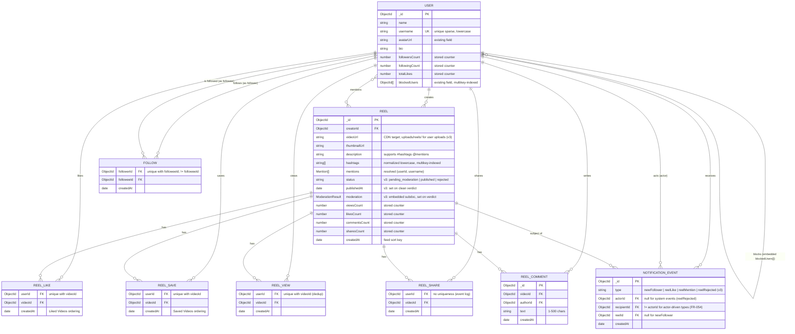
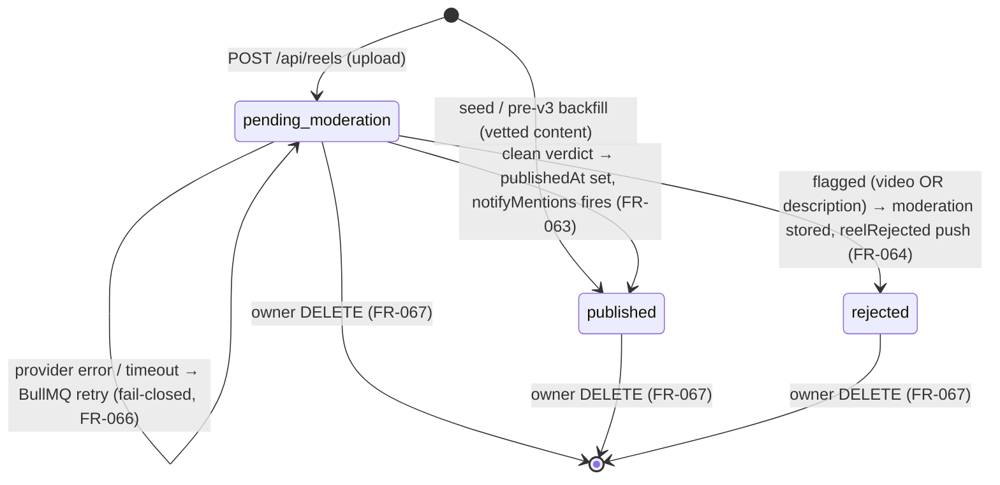

# Data Model: Reels / Short Videos Feed (v3 — upload + content moderation)

**Feature**: `021-reels-video-feed` | **Date**: 2026-07-02 (v2 approved & implemented) / 2026-07-03 (v3 delta)
**Status**: ⚠️ **The v3 delta (reel `status` state machine, embedded moderation result, `reelRejected` event type, new indexes) re-triggers the FR-056 approval gate — stakeholder approval required before implementing the v3 backend tasks.** The v2 schema below is already implemented and live.

Storage: **MongoDB via Mongoose** (clarified — real DB this phase, supersedes the v1 in-memory mock store). All schemas live in `chat-app-backend/src/modules/reels/schemas/` except `User`, which extends the existing `src/modules/users/schemas/user.schema.ts`. Out of scope by stakeholder direction: live streaming, wallets, coin/diamond systems — no such fields anywhere below.

## ERD



## Reel moderation status state machine (v3 — FR-061..FR-066)



- `pending_moderation` is the only entry state for uploads and the **default**; the BullMQ worker is the **only writer** of `status` transitions (guarded `findOneAndUpdate` with a `status: 'pending_moderation'` precondition — retries can never double-fire side effects).
- `published` and `rejected` are terminal except for owner deletion. No unpublish/re-review in v1 (no human review/appeals — spec Assumption).
- **Visibility invariant**: only `published` reels are servable to non-owners on ANY surface; owners additionally see their own `pending_moderation`/`rejected` reels (with `status` in the DTO). Engagement writes require `published` (404 otherwise).

## Collections & indexes

### `users` (EXTENDS existing schema — additive only)

| Field | Type | New? | Notes |
|---|---|---|---|
| `name` | string | existing | Full name |
| `username` | string | **NEW** | `unique: true, sparse: true`, lowercase; backfilled from `name` + discriminator by seed/migration |
| `avatarUrl` | string | existing | Profile picture — the one shared identity avatar (US7 data binding) |
| `bio` | string | **NEW** | default `''` |
| `followersCount` | number | **NEW** | stored counter, default 0 |
| `followingCount` | number | **NEW** | stored counter, default 0 |
| `totalLikes` | number | **NEW** | stored counter (Σ likes over own reels), default 0 |
| `blockedUsers` | ObjectId[] | existing | Single shared block list (chat + Reels) |

**Indexes**: existing + `{ username: 1 }` unique sparse; `{ blockedUsers: 1 }` multikey (reverse-block lookup for FR-052/053); `{ name: 1 }` (user search assist).

### `reels`

| Field | Type | Notes |
|---|---|---|
| `creatorId` | ObjectId → users | |
| `videoUrl` | string | may be relative → `UrlUtils.resolveMediaUrl` client-side |
| `thumbnailUrl` | string | |
| `description` | string ≤ 2200 | FR-047 |
| `hashtags` | string[] | parsed at write time, lowercase, no `#`, deduped |
| `mentions` | `[{ userId: ObjectId, username: string }]` | only resolved users (FR-047) |
| `status` | string enum | **v3** — `pending_moderation` (default) \| `published` \| `rejected` (FR-061); seed + pre-v3 backfill = `published` |
| `publishedAt` | Date? | **v3** — set by the worker on the clean-verdict transition |
| `moderation` | ModerationResult? | **v3** — embedded subdoc, written once by the worker (see below) |
| `viewsCount` / `likesCount` / `commentsCount` / `sharesCount` | number | stored counters, default 0 (FR-055) |
| `createdAt` | Date | `timestamps: true`; feed sort key |

**`ModerationResult` embedded subdoc (v3 — the spec's Moderation Result entity)**:

| Field | Type | Notes |
|---|---|---|
| `verdict` | `'clean' \| 'flagged'` | |
| `flaggedSource` | `'video' \| 'description'`? | set when flagged (clarified: both modalities screened) |
| `categories` | string[] | provider categories (explicit, nudity, NSFW…) for audit |
| `providerRef` | string? | provider request/media id — audit trail |
| `completedAt` | Date | |

**Indexes (v3 revision)**: `{ status: 1, createdAt: -1, _id: -1 }` (feed cursor — equality prefix on status keeps the cursor pattern; replaces the plain createdAt index); `{ creatorId: 1, status: 1, createdAt: -1 }` (profile grid: others filter `published`, owner reads all statuses); `{ hashtags: 1, createdAt: -1 }` (hashtag feed — service adds the status filter; hashtag substring search unchanged, R11); `{ status: 1, updatedAt: 1 }` (pending-sweep re-enqueue scan, R17).

### `reel_likes` / `reel_saves` / `reel_views`

| Field | Type | Notes |
|---|---|---|
| `userId` | ObjectId → users | |
| `videoId` | ObjectId → reels | |
| `createdAt` | Date | ordering for Liked/Saved lists |

**Indexes** (each collection): `{ userId: 1, videoId: 1 }` **unique** (toggle/dedup integrity); `{ userId: 1, createdAt: -1 }` (liked/saved list cursors); `{ videoId: 1 }` (per-reel maintenance). Likes additionally drive `users.totalLikes` on the reel's creator. Saves have **no public counter** (private — FR-049). Views insert-if-absent; only a real insert `$inc`s `viewsCount` (FR-048).

### `reel_shares` (event log — unchanged semantics from v1)

`{ userId, videoId, createdAt }`, **no uniqueness** (each in-app send / Copy Link appends — FR-021a). Index `{ videoId: 1 }`.

### `reel_comments`

`{ videoId, authorId, text (1–500 trimmed), createdAt }`. Index `{ videoId: 1, createdAt: -1, _id: -1 }` (comment page cursor).

### `follows`

`{ followerId, followeeId, createdAt }`. **Indexes**: `{ followerId: 1, followeeId: 1 }` unique; `{ followeeId: 1 }` (follower lookups); `{ followerId: 1, createdAt: -1 }` (**"reels from users I follow"** foundation — FR-055: the future following-feed query is `follows[followerId=me] → reels[creatorId ∈ followees]`, both legs indexed). `followerId != followeeId` enforced in service (FR-031).

### `notification_events`

`{ type: 'newFollower'|'reelLike'|'reelMention'|'reelRejected' (v3), actorId?, recipientId, reelId?, createdAt }`. `actorId != recipientId` enforced for actor-driven types (FR-054); **v3**: `actorId` is now optional — `null` for system-originated `reelRejected` events (the self-skip rule does not apply to system types). **Indexes**: `{ recipientId: 1, createdAt: -1 }` (future notification center); `{ type: 1, actorId: 1, recipientId: 1, reelId: 1 }` unique (re-like/re-follow never re-notifies — R14; also makes `reelRejected` and publish-time mentions exactly-once under worker retries — R17/R18).

## Counter integrity rules (FR-055 — binding)

| Action | Relation write | Counter `$inc` (same repository method) |
|---|---|---|
| Like ON / OFF | insert / delete `reel_likes` (unique idx) | `reels.likesCount ±1` **and** creator `users.totalLikes ±1` |
| Save ON / OFF | insert / delete `reel_saves` | none (private) |
| View (first per user) | insert-if-absent `reel_views` | `reels.viewsCount +1` only on actual insert |
| Share | append `reel_shares` | `reels.sharesCount +1` |
| Comment add | insert `reel_comments` | `reels.commentsCount +1` |
| Follow ON / OFF | insert / delete `follows` (unique idx) | follower `followingCount ±1`, followee `followersCount ±1` |

Direction always derives from the relation-write outcome (`upsertedCount` / `deletedCount`) — a no-op relation write performs **no** `$inc`. Reads never aggregate.

**v3 additions**:

| Action | Relation/doc writes | Counter effect |
|---|---|---|
| Upload (`POST /api/reels`) | insert reel (`status: pending_moderation`) | none until published |
| Publish transition (worker) | `status → published`, `publishedAt` | none (counters start at 0) |
| Reject transition (worker) | `status → rejected`, `moderation` stored | none (engagement was never possible) |
| Owner delete (FR-067) | creator `totalLikes −= reel.likesCount` **first**, then delete relations (`reel_likes/saves/views/shares/comments` by `videoId`), reel-scoped `notification_events`, the reel doc, and media files | creator `totalLikes` adjusted; all reel counters die with the doc |

## Visibility & block filtering (applies to every read — FR-052/053 + FR-061 v3)

```
blockSet(viewer)  = viewer.blockedUsers ∪ { u : viewer ∈ u.blockedUsers }     // 2nd leg via multikey index
visibility(viewer) = status == 'published' OR creatorId == viewer             // v3: owner sees own any-status
```

Both filters compose on every surface: main feed, `?creatorId=`/`?hashtag=` feeds, `GET /reels/:id` (→404), profile (→404), profile grid (owner grid includes own pending/rejected with `status`), liked/saved lists, comments (author-filtered), reels search, user search. Engagement writes (like/comment/share/save/view) additionally require `status == 'published'` → 404 otherwise (FR-064). Enforced in `ReelsService` only — never client-side.

## Flutter domain entities (delta from v1)

### `Reel` (extended)

```
id, videoUrl, thumbnailUrl, createdAt,
creator: ReelCreator,                       // + username
description: String,
hashtags: List<String>,
mentions: List<ReelMention>,                // NEW entity: userId, username
status: ReelStatus,                         // v3 NEW enum: pendingModeration | published | rejected
viewsCount, likesCount, commentsCount, sharesCount,
viewerLiked, viewerSaved (bool),            // viewerSaved NEW
deepLinkUrl (derived getter)
```

### `CreatorProfile` (extended)

`+ username, isSelf` (already had); Liked/Saved tabs use `ReelsPage` fetches, not profile payload.

### `SearchResults` (NEW)

```
videos: List<Reel>, videosCursor: String?,
users: List<SearchUser>, usersCursor: String?      // SearchUser: id, username, name, avatarUrl
```

## Presentation state (delta)

- **`ReelsInteractionState`**: `+ saves: Map<String /*reelId*/, bool>` (optimistic, reverting — FR-049); `+ viewedThisSession: Set<String>` guard (not emitted-on; internal dedup for FR-048 client side).
- **`SearchState`** (NEW, `SearchCubit`): `status (idle|loading|ready|error), query, videos, users, videosCursor, usersCursor` — debounced 350 ms, stale responses dropped by query token.
- **`CreatorProfileState`**: `+ likedPage / savedPage` sub-states, lazily loaded when the self-tabs first open (owner-only; tabs absent for non-self). **v3**: own-grid items carry `status` → `reel_status_badge.dart` overlays (Processing / Removed); delete action refreshes the grid.
- **`UploadState`** (v3 NEW, `UploadCubit`): `idle → picked(file, duration) → trimming? → composing(description) → uploading(progress 0..1) → success(reel) | failure(retryable)`; `CancelToken` cancelled on close; no partial state survives a failure (FR-060).

## Reel-share chat message — unchanged from v1

`type: 'reelShare'`, `metadata: { reelId, thumbnailUrl, creatorName, deepLink }`; standard message lifecycle (constitution IX).

## Sliding window invariant — unchanged from v1

`window(N) = {N-1, N, N+1}`, `|players| ≤ 3`, N+2 HTTP prefetch.
