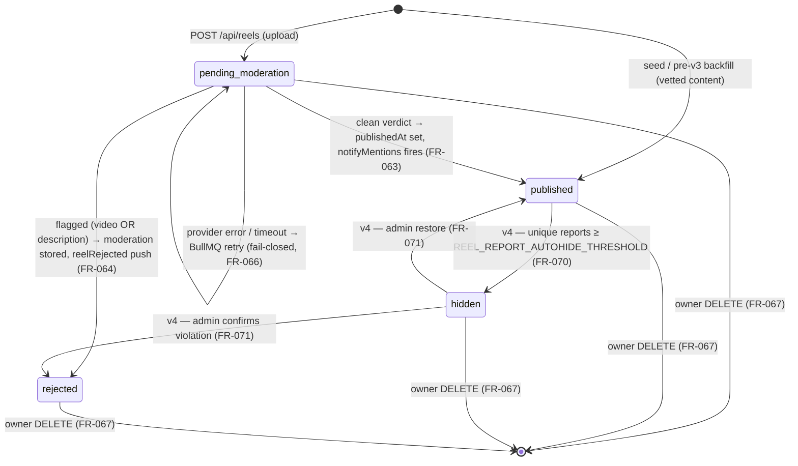

# Data Model: Reels / Short Videos Feed (v4 — user reporting + reposting/feed tabs)

**Feature**: `021-reels-video-feed` | **Date**: 2026-07-02 (v2 approved & implemented) / 2026-07-03 (v3 approved & implemented) / 2026-07-05 (v4 delta)
**Status**: ✅ **The v4 delta (new `reel_reports` and `reel_reposts` collections, the `hidden` status value + amended state machine, `reportsCount` counter, feed-composition rules, new indexes) was approved by the stakeholder on 2026-07-05 (FR-056 gate).** The v3 schema below is already implemented and live; v4 backend implementation proceeds.

Storage: **MongoDB via Mongoose** (clarified — real DB this phase, supersedes the v1 in-memory mock store). All schemas live in `chat-app-backend/src/modules/reels/schemas/` except `User`, which extends the existing `src/modules/users/schemas/user.schema.ts`. Out of scope by stakeholder direction: live streaming, wallets, coin/diamond systems — no such fields anywhere below.

## ERD

```mermaid
erDiagram
    USER ||--o{ REEL : "creates"
    USER ||--o{ REEL_LIKE : "likes"
    USER ||--o{ REEL_SAVE : "saves"
    USER ||--o{ REEL_VIEW : "views"
    USER ||--o{ REEL_SHARE : "shares"
    USER ||--o{ REEL_COMMENT : "writes"
    USER ||--o{ REEL_REPORT : "reports (v4)"
    USER ||--o{ REEL_REPOST : "reposts (v4)"
    USER ||--o{ FOLLOW : "follows (as follower)"
    USER ||--o{ FOLLOW : "is followed (as followee)"
    USER ||--o{ USER : "blocks (embedded blockedUsers[])"
    USER ||--o{ NOTIFICATION_EVENT : "receives"
    USER ||--o{ NOTIFICATION_EVENT : "acts (actor)"
    REEL ||--o{ REEL_LIKE : "has"
    REEL ||--o{ REEL_SAVE : "has"
    REEL ||--o{ REEL_VIEW : "has"
    REEL ||--o{ REEL_SHARE : "has"
    REEL ||--o{ REEL_COMMENT : "has"
    REEL ||--o{ REEL_REPORT : "has (v4)"
    REEL ||--o{ REEL_REPOST : "has (v4)"
    REEL ||--o{ NOTIFICATION_EVENT : "subject of"
    REEL }o--o{ USER : "mentions"

    USER {
        ObjectId _id PK
        string name
        string username UK "unique sparse, lowercase"
        string avatarUrl "existing field"
        string bio
        number followersCount "stored counter"
        number followingCount "stored counter"
        number totalLikes "stored counter"
        ObjectId[] blockedUsers "existing field, multikey-indexed"
    }
    REEL {
        ObjectId _id PK
        ObjectId creatorId FK
        string videoUrl "CDN target; uploads/reels/ for user uploads (v3)"
        string thumbnailUrl
        string description "supports #hashtags @mentions"
        string[] hashtags "normalized lowercase, multikey-indexed"
        Mention[] mentions "resolved {userId, username}"
        string status "v3: pending_moderation | published | rejected; v4: + hidden"
        date publishedAt "v3: set on clean verdict"
        ModerationResult moderation "v3: embedded subdoc, set on verdict"
        number reportsCount "v4: stored counter of unique reporters"
        boolean adminRestored "v4: set on admin restore; permanent auto-hide immunity"
        number viewsCount "stored counter"
        number likesCount "stored counter"
        number commentsCount "stored counter"
        number sharesCount "stored counter"
        date createdAt "feed sort key"
    }
    REEL_LIKE {
        ObjectId userId FK "unique with videoId"
        ObjectId videoId FK
        date createdAt "Liked Videos ordering"
    }
    REEL_SAVE {
        ObjectId userId FK "unique with videoId"
        ObjectId videoId FK
        date createdAt "Saved Videos ordering"
    }
    REEL_VIEW {
        ObjectId userId FK "unique with videoId (dedup)"
        ObjectId videoId FK
        date createdAt
    }
    REEL_SHARE {
        ObjectId userId FK "no uniqueness (event log)"
        ObjectId videoId FK
        date createdAt
    }
    REEL_COMMENT {
        ObjectId _id PK
        ObjectId videoId FK
        ObjectId authorId FK
        string text "1-500 chars"
        date createdAt
    }
    REEL_REPORT {
        ObjectId videoId FK "v4: unique with reporterId"
        ObjectId reporterId FK
        string reason "spam | nudity | violence | hate_speech | other"
        string customReason "required non-empty <=500 iff reason=other"
        date createdAt
    }
    REEL_REPOST {
        ObjectId videoId FK "v4: unique with reposterId"
        ObjectId reposterId FK
        date createdAt "For You injection sort key"
    }
    FOLLOW {
        ObjectId followerId FK "unique with followeeId; != followeeId"
        ObjectId followeeId FK
        date createdAt
    }
    NOTIFICATION_EVENT {
        ObjectId _id PK
        string type "newFollower | reelLike | reelMention | reelRejected (v3)"
        ObjectId actorId FK "null for system events (reelRejected)"
        ObjectId recipientId FK "!= actorId for actor-driven types (FR-054)"
        ObjectId reelId FK "null for newFollower"
        date createdAt
    }
```



## Reel moderation status state machine (v4 — FR-061..FR-066, FR-070..FR-072)



- `pending_moderation` is the only entry state for uploads and the **default**.
- **Status writers (v4 — exactly three, all guarded `findOneAndUpdate` with a status precondition so retries/races never double-fire side effects)**: (1) the BullMQ moderation worker (`pending_moderation → published | rejected`); (2) the report service (`published → hidden`, precondition `status: 'published' AND adminRestored: { $ne: true }`, fired by the report whose insert brings the unique-reporter count to the threshold — a restored reel is permanently immune, FR-070); (3) the admin moderation endpoint (`hidden → published | rejected`, precondition `status: 'hidden'`; the restore branch also sets `adminRestored: true`). Amends the v3 "worker is the only writer" invariant.
- `rejected` is terminal except for owner deletion. No appeals/re-review for AI-rejected uploads in v1 (spec Assumption). `hidden` resolves only via the admin endpoint or owner deletion.
- **Visibility invariant (unchanged formula)**: only `published` reels are servable to non-owners on ANY surface — `hidden` is automatically excluded since it is not `published`; owners additionally see their own `pending_moderation`/`hidden`/`rejected` reels (with `status` in the DTO; owner-facing labels: Processing / Under review / Removed). Engagement writes — now including reports and reposts — require `published` (404 otherwise). Engagement recorded before hiding is preserved; an admin restore reinstates the reel with prior counts intact.

## Collections & indexes

### `users` (EXTENDS existing schema — additive only)

| Field | Type | New? | Notes |
|---|---|---|---|
| `name` | string | existing | Full name |
| `username` | string | **NEW** | `unique: true, sparse: true`, lowercase; backfilled from `name` + discriminator by seed/migration |
| `avatarUrl` | string | existing | Profile picture — the one shared identity avatar (US7 data binding) |
| `bio` | string | **NEW** | default `''` |
| `followersCount` | number | **NEW** | stored counter, default 0 |
| `followingCount` | number | **NEW** | stored counter, default 0 |
| `totalLikes` | number | **NEW** | stored counter (Σ likes over own reels), default 0 |
| `blockedUsers` | ObjectId[] | existing | Single shared block list (chat + Reels) |

**Indexes**: existing + `{ username: 1 }` unique sparse; `{ blockedUsers: 1 }` multikey (reverse-block lookup for FR-052/053); `{ name: 1 }` (user search assist).

### `reels`

| Field | Type | Notes |
|---|---|---|
| `creatorId` | ObjectId → users | |
| `videoUrl` | string | may be relative → `UrlUtils.resolveMediaUrl` client-side |
| `thumbnailUrl` | string | |
| `description` | string ≤ 2200 | FR-047 |
| `hashtags` | string[] | parsed at write time, lowercase, no `#`, deduped |
| `mentions` | `[{ userId: ObjectId, username: string }]` | only resolved users (FR-047) |
| `status` | string enum | **v3** — `pending_moderation` (default) \| `published` \| `rejected` (FR-061); seed + pre-v3 backfill = `published`. **v4** — + `hidden` (report auto-hide, FR-070) |
| `publishedAt` | Date? | **v3** — set by the worker on the clean-verdict transition |
| `moderation` | ModerationResult? | **v3** — embedded subdoc, written once by the worker (see below) |
| `reportsCount` | number | **v4** — stored counter of unique reporters, default 0 (FR-055 pattern); `$inc` only on a real `reel_reports` insert; the insert that reaches `REEL_REPORT_AUTOHIDE_THRESHOLD` triggers the guarded hide transition (FR-070). Never exposed in public DTOs |
| `adminRestored` | boolean | **v4** — default `false`; set `true` by the admin restore transition (FR-071) and never unset: the reel is permanently immune to the auto-hide threshold (reports still recorded/counted for audit — FR-070 "one auto-hide per reel ever"). Never exposed in public DTOs |
| `viewsCount` / `likesCount` / `commentsCount` / `sharesCount` | number | stored counters, default 0 (FR-055) |
| `createdAt` | Date | `timestamps: true`; feed sort key |

**`ModerationResult` embedded subdoc (v3 — the spec's Moderation Result entity)**:

| Field | Type | Notes |
|---|---|---|
| `verdict` | `'clean' \| 'flagged'` | |
| `flaggedSource` | `'video' \| 'description'`? | set when flagged (clarified: both modalities screened) |
| `categories` | string[] | provider categories (explicit, nudity, NSFW…) for audit |
| `providerRef` | string? | provider request/media id — audit trail |
| `completedAt` | Date | |

**Indexes (v3 revision)**: `{ status: 1, createdAt: -1, _id: -1 }` (feed cursor — equality prefix on status keeps the cursor pattern; replaces the plain createdAt index); `{ creatorId: 1, status: 1, createdAt: -1 }` (profile grid: others filter `published`, owner reads all statuses); `{ hashtags: 1, createdAt: -1 }` (hashtag feed — service adds the status filter; hashtag substring search unchanged, R11); `{ status: 1, updatedAt: 1 }` (pending-sweep re-enqueue scan, R17).

### `reel_likes` / `reel_saves` / `reel_views`

| Field | Type | Notes |
|---|---|---|
| `userId` | ObjectId → users | |
| `videoId` | ObjectId → reels | |
| `createdAt` | Date | ordering for Liked/Saved lists |

**Indexes** (each collection): `{ userId: 1, videoId: 1 }` **unique** (toggle/dedup integrity); `{ userId: 1, createdAt: -1 }` (liked/saved list cursors); `{ videoId: 1 }` (per-reel maintenance). Likes additionally drive `users.totalLikes` on the reel's creator. Saves have **no public counter** (private — FR-049). Views insert-if-absent; only a real insert `$inc`s `viewsCount` (FR-048).

### `reel_shares` (event log — unchanged semantics from v1)

`{ userId, videoId, createdAt }`, **no uniqueness** (each in-app send / Copy Link appends — FR-021a). Index `{ videoId: 1 }`.

### `reel_reports` (v4 — FR-069)

| Field | Type | Notes |
|---|---|---|
| `videoId` | ObjectId → reels | naming follows the sibling relation collections (`videoId`, not `reelId`) |
| `reporterId` | ObjectId → users | never the reel's creator (service-enforced, FR-069) |
| `reason` | string enum | `spam \| nudity \| violence \| hate_speech \| other` |
| `customReason` | string? | trimmed ≤500; **required non-empty iff `reason == 'other'`**, absent otherwise (DTO-validated) |
| `createdAt` | Date | |

**Indexes**: `{ videoId: 1, reporterId: 1 }` **unique** (one report per user per reel — duplicate insert is the idempotent no-op path); `{ videoId: 1 }` (per-reel audit/maintenance + delete cascade); `{ reporterId: 1, createdAt: -1 }` (daily rate-limit count — `REEL_REPORT_DAILY_LIMIT`, default 20/day, FR-069 — and reporter audit). Reports accepted only against `published` reels (unknown-reel path otherwise). Retained for admin audit; deleted with the reel in the FR-067 cascade.

### `reel_reposts` (v4 — FR-073)

| Field | Type | Notes |
|---|---|---|
| `videoId` | ObjectId → reels | |
| `reposterId` | ObjectId → users | never the reel's creator (no self-repost, FR-073) |
| `createdAt` | Date | For You injection sort key (repost recency, FR-076) |

**Indexes**: `{ videoId: 1, reposterId: 1 }` **unique** (repost/un-repost toggle integrity — same relation-write-outcome pattern as likes/saves); `{ reposterId: 1, createdAt: -1 }` (**injection leg**: "reposts by users I follow" — `follows[followerId=me] → reel_reposts[reposterId ∈ followees]`, both legs indexed per FR-055); `{ videoId: 1 }` (delete cascade). No public counter (FR-073). Deleted with the reel in the FR-067 cascade.

### `reel_comments`

`{ videoId, authorId, text (1–500 trimmed), createdAt }`. Index `{ videoId: 1, createdAt: -1, _id: -1 }` (comment page cursor).

### `follows`

`{ followerId, followeeId, createdAt }`. **Indexes**: `{ followerId: 1, followeeId: 1 }` unique; `{ followeeId: 1 }` (follower lookups); `{ followerId: 1, createdAt: -1 }` (**"reels from users I follow"** foundation — FR-055: the future following-feed query is `follows[followerId=me] → reels[creatorId ∈ followees]`, both legs indexed). `followerId != followeeId` enforced in service (FR-031).

### `notification_events`

`{ type: 'newFollower'|'reelLike'|'reelMention'|'reelRejected' (v3), actorId?, recipientId, reelId?, createdAt }`. `actorId != recipientId` enforced for actor-driven types (FR-054); **v3**: `actorId` is now optional — `null` for system-originated `reelRejected` events (the self-skip rule does not apply to system types). **Indexes**: `{ recipientId: 1, createdAt: -1 }` (future notification center); `{ type: 1, actorId: 1, recipientId: 1, reelId: 1 }` unique (re-like/re-follow never re-notifies — R14; also makes `reelRejected` and publish-time mentions exactly-once under worker retries — R17/R18).

## Counter integrity rules (FR-055 — binding)

| Action | Relation write | Counter `$inc` (same repository method) |
|---|---|---|
| Like ON / OFF | insert / delete `reel_likes` (unique idx) | `reels.likesCount ±1` **and** creator `users.totalLikes ±1` |
| Save ON / OFF | insert / delete `reel_saves` | none (private) |
| View (first per user) | insert-if-absent `reel_views` | `reels.viewsCount +1` only on actual insert |
| Share | append `reel_shares` | `reels.sharesCount +1` |
| Comment add | insert `reel_comments` | `reels.commentsCount +1` |
| Follow ON / OFF | insert / delete `follows` (unique idx) | follower `followingCount ±1`, followee `followersCount ±1` |

Direction always derives from the relation-write outcome (`upsertedCount` / `deletedCount`) — a no-op relation write performs **no** `$inc`. Reads never aggregate.

**v3 additions**:

| Action | Relation/doc writes | Counter effect |
|---|---|---|
| Upload (`POST /api/reels`) | insert reel (`status: pending_moderation`) | none until published |
| Publish transition (worker) | `status → published`, `publishedAt` | none (counters start at 0) |
| Reject transition (worker) | `status → rejected`, `moderation` stored | none (engagement was never possible) |
| Owner delete (FR-067) | creator `totalLikes −= reel.likesCount` **first**, then delete relations (`reel_likes/saves/views/shares/comments` — **v4: + `reel_reports/reel_reposts`** — by `videoId`), reel-scoped `notification_events`, the reel doc, and media files | creator `totalLikes` adjusted; all reel counters die with the doc |

**v4 additions**:

| Action | Relation write | Counter / status effect |
|---|---|---|
| Report (first per user — FR-069) | insert-if-absent `reel_reports` (unique idx), **only if the reporter is under `REEL_REPORT_DAILY_LIMIT`** (default 20/day — over-limit submissions record nothing) | `reels.reportsCount +1` only on actual insert; when the post-`$inc` value ≥ `REEL_REPORT_AUTOHIDE_THRESHOLD` **and `adminRestored != true`** → guarded `published → hidden` transition (FR-070), exactly-once |
| Report (duplicate) | no-op (unique idx) | none — idempotent success response |
| Repost ON / OFF (FR-073) | insert / delete `reel_reposts` (unique idx) | none (no public counter; direction from relation-write outcome, same as saves) |
| Admin restore / reject (FR-071) | status transition only (guarded, precondition `hidden`); restore also sets `adminRestored: true` (permanent auto-hide immunity) | none — engagement counters survive the hidden period untouched |

## Visibility & block filtering (applies to every read — FR-052/053 + FR-061 v3)

```
blockSet(viewer)  = viewer.blockedUsers ∪ { u : viewer ∈ u.blockedUsers }     // 2nd leg via multikey index
visibility(viewer) = status == 'published' OR creatorId == viewer             // v3: owner sees own any-status
```

Both filters compose on every surface: main/For You feed, Following feed (v4), `?creatorId=`/`?hashtag=` feeds, `GET /reels/:id` (→404), profile (→404), profile grid (owner grid includes own pending/hidden/rejected with `status`), liked/saved lists, comments (author-filtered), reels search, user search. Engagement writes (like/comment/share/save/view — **v4: + report/repost**) additionally require `status == 'published'` → 404 otherwise (FR-064/FR-069/FR-073). Enforced in `ReelsService` only — never client-side.

**v4 — repost edge (FR-078)**: For You injection additionally filters the **reposter** against the viewer's `blockSet` — an injected item is suppressed when viewer↔reposter are blocked in either direction, independent of the creator-edge rules (the reel may still surface organically without a badge).

## Feed composition (v4 — FR-075/FR-076)

```
followees(viewer)  = follows[followerId == viewer].followeeId                       // indexed leg 1
Following feed     = reels[creatorId ∈ followees(viewer)]                           // {creatorId, status, createdAt} index (exists since v3)
                     ∘ visibility ∘ blockSet, sorted createdAt desc, finite, cursor-paginated. NO reposts.
repost leg(viewer) = reel_reposts[reposterId ∈ followees(viewer) ∪ {viewer}]        // {reposterId, createdAt} index; includes own reposts
For You feed       = merge(global leg (v1 FR-007 behavior, catalog loop),
                           repost leg sorted by repost createdAt desc)
                     ∘ visibility ∘ blockSet (creator edge) ∘ blockSet (reposter edge)
```

- **Dedup (FR-076)**: at most one instance of a reel per feed session — the repost-attributed instance wins over the organic one; multiple followed reposters of the same reel collapse to the **most recent** one for `repostedBy`. The service dedups within/across the two legs per page; `ReelsFeedBloc` additionally drops already-loaded reel ids client-side (it must already tolerate repeats from v1 catalog looping — verified during implementation, research R20).
- **Cursors**: the two legs advance independent cursors packed into one opaque page token (R20 decides the exact encoding); the Following feed reuses the standard single-leg cursor pattern.
- **`repostedBy` hydration**: injected items carry `{ id, username, name, avatarUrl }` of the attributed reposter; the client renders "You reposted" when `repostedBy.id == viewer`.

## Flutter domain entities (delta from v1)

### `Reel` (extended)

```
id, videoUrl, thumbnailUrl, createdAt,
creator: ReelCreator,                       // + username
description: String,
hashtags: List<String>,
mentions: List<ReelMention>,                // NEW entity: userId, username
status: ReelStatus,                         // v3 enum: pendingModeration | published | rejected; v4: + hidden
viewsCount, likesCount, commentsCount, sharesCount,
viewerLiked, viewerSaved (bool),            // viewerSaved NEW
viewerReposted (bool),                      // v4 NEW — drives the action-column Repost button's active state (clarified: primary action, Save's former slot)
repostedBy: ReelReposter?,                  // v4 NEW entity: id, username, name, avatarUrl — null for organic items
deepLinkUrl (derived getter)
```

### `CreatorProfile` (extended)

`+ username, isSelf` (already had); Liked/Saved tabs use `ReelsPage` fetches, not profile payload.

### `SearchResults` (NEW)

```
videos: List<Reel>, videosCursor: String?,
users: List<SearchUser>, usersCursor: String?      // SearchUser: id, username, name, avatarUrl
```

## Presentation state (delta)

- **`ReelsInteractionState`**: `+ saves: Map<String /*reelId*/, bool>` (optimistic, reverting — FR-049); `+ viewedThisSession: Set<String>` guard (not emitted-on; internal dedup for FR-048 client side).
- **`SearchState`** (NEW, `SearchCubit`): `status (idle|loading|ready|error), query, videos, users, videosCursor, usersCursor` — debounced 350 ms, stale responses dropped by query token.
- **`CreatorProfileState`**: `+ likedPage / savedPage` sub-states, lazily loaded when the self-tabs first open (owner-only; tabs absent for non-self). **v3**: own-grid items carry `status` → `reel_status_badge.dart` overlays (Processing / Removed); delete action refreshes the grid.
- **`UploadState`** (v3 NEW, `UploadCubit`): `idle → picked(file, duration) → trimming? → composing(description) → uploading(progress 0..1) → success(reel) | failure(retryable)`; `CancelToken` cancelled on close; no partial state survives a failure (FR-060).
- **`ReelsFeedBloc`** (v4): parameterized by `feedScope` (`forYou` default | `following` — joining the existing creator/hashtag/search scopes); one instance per tab, only the active tab's PageView plays (FR-009), per-tab resume position (FR-004a). Pagination dedups already-loaded reel ids (FR-076/R20).
- **`ReelsInteractionState`** (v4): `+ reposts: Map<String /*reelId*/, bool>` (optimistic Repost/Un-repost, reverting — FR-073, same pattern as saves).
- **Report flow** (v4): screen-local sheet state (selected reason, custom text) + a fire-and-forget `reportReel` call surfaced through the interaction cubit — confirmation snackbar on success, notice on failure; no dedicated cubit needed (mirrors the share-record call).
- **Owner badges** (v4): `reel_status_badge.dart` gains an "Under review" case for `ReelStatus.hidden` (FR-072).

## Reel-share chat message — unchanged from v1

`type: 'reelShare'`, `metadata: { reelId, thumbnailUrl, creatorName, deepLink }`; standard message lifecycle (constitution IX).

## Sliding window invariant — unchanged from v1

`window(N) = {N-1, N, N+1}`, `|players| ≤ 3`, N+2 HTTP prefetch.

## v5 delta (2026-07-06 — camera-first creation, FR-079–FR-084)

**ERD: no change.** No new collections, fields, indexes, or state transitions — v5 is a client-flow overhaul plus one new **read path** over the existing `follows` collection (`{followerId: 1, createdAt: -1}` leg, already indexed): `GET /api/reels/me/following` returns the caller's followees as `{id, username, name, avatarUrl}` pages for the mention-suggestion overlay (FR-084, contracts §31). Block filtering is applied defensively on read (a block does not delete the follow relation). The FR-056 approval gate is therefore satisfied by stakeholder acknowledgment of this note — there is no schema diff to approve.

**Flutter domain delta**:

```dart
class FollowedUser extends Equatable {   // NEW — mention suggestions (FR-083/FR-084)
  final String id;
  final String username;
  final String name;
  final String? avatarUrl;
}
```

**Presentation state delta**: `CaptureCubit` — `idle → recording(elapsed, cap) → captured(filePath)` plus `permissionDenied` (single continuous clip; auto-stop at the 15s/30s/60s cap; segment <1 s → back to `idle` with notice). `MentionSuggestionsCubit` — `hidden | loading | active(query, matches)` over the once-fetched following list. Both Cubit + Equatable + constructor DI (constitution II). The existing `UploadCubit` keeps the submit/progress/error machine unchanged; the trimmer's `maxDuration` becomes a route parameter (15s/30s/60s from capture, 60s for gallery).
